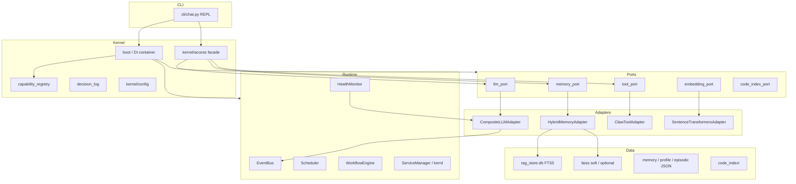
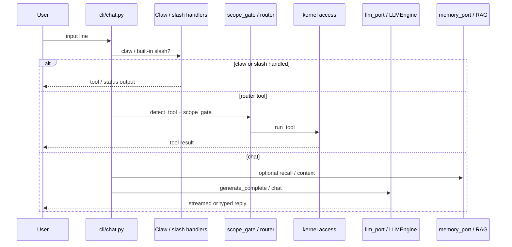

# KerrOS

**Python 3 terminal AI assistant** with a small DI kernel, ports/adapters,
workspace claw tools, RAG memory, and optional local or cloud LLMs.

Repo alias: `offline_ai` (many modules resolve paths under `~/offline_ai`).

KerrOS is **not** OmniRoute. OmniRoute is an optional OpenAI-compatible
meta-provider KerrOS can call. LiteLLM / llama.cpp / Ollama / vLLM are likewise
optional sidecars — default off.

---

## Quick start

```bash
# Resolve hard-coded ~/offline_ai paths
ln -sfn "$PWD" "$HOME/offline_ai"

pip install -r requirements.txt
cp .env.example .env   # set GROQ_API_KEY for online mode

python3 cli/chat.py
```

- With internet: prompts `Online mode? [y/n]`.
- Online needs a cloud key (e.g. `GROQ_API_KEY`).
- Offline needs a local llama.cpp binary + GGUF under `models/` (gitignored).
- Claw slash-commands (`/read`, `/exec`, …) run **before** any LLM call and
  work without a model or API key.

```bash
# Tests
./scripts/run_tests.sh
# or: python3 -m unittest discover -s tests -p 'test_*.py' -t .
```

No Node build is required for the app (root `package.json` is optional MCP tooling only).

---

## What KerrOS is

| Is | Is not |
|----|--------|
| Terminal AIOS / REPL assistant | A public LLM gateway product |
| Kernel + ports + adapters | OmniRoute itself |
| FTS-primary RAG + optional vectors | A bundled 238K-chunk knowledge dump |
| Soft/Fake on-ramps for local LLM/RAG/coding | Production TLS / HA seals by default |

**Target outcomes:** persistent chat + knowledge recall, one operator-chosen LLM
path (cloud or local), capability manifests for tools/providers, auditable
scope gates, self-extensible workflows/skills.

---

## Architecture



### Layers

| Layer | Path | Role |
|-------|------|------|
| **CLI** | `cli/chat.py` | REPL, mode switch, slash-commands, agent entrypoints |
| **Kernel** | `kernel/` | Boot lifecycle, config, DI, access facade, capabilities, decision log, watchdog |
| **Ports** | `ports/` | Interfaces: LLM, Memory, Tool, Embedding, CodeIndex, Storage, Search, … |
| **Adapters** | `adapters/` | Implementations behind ports (composite LLM, hybrid memory, claw, …) |
| **Runtime** | `runtime/` | EventBus, scheduler, workflows, health, services, optional mesh |
| **Agents** | `agents/` | Userspace Knowledge / Security / Code / Research / Planner / Reflection / Document |
| **RAG** | `rag/` | SQLite FTS store + path guards |
| **Memory** | `memory/` | Session, profile, episodic → semantic helpers |
| **Tools** | `tools/` | Claw FS/exec, scope gate, router tools, devops |
| **Config** | `config/` | Capabilities, profiles, scope policy, workflow YAML |
| **Deploy** | `deploy/` | Optional Docker kits (ollama, vllm, llama_cpp, omniroute, qdrant, …) |
| **Docs** | `docs/adr/` | Architecture decisions (ADR-001 … ADR-054+) |

Boot phases: `INIT → CONFIG → SERVICES → PORTS → READY`
(`kernel/boot.py`, `docs/KERNEL_CONTRACT.md`).

---

## Request workflow



### REPL order of operations

1. **`kernel_boot()`** — DI, capabilities, ports, runtime services.
2. **Mode** — online (`CompositeLLMAdapter` / cloud) or offline (`LLMEngine` + GGUF).
3. For each line:
   1. Built-in slash (`/help`, `/health`, `/llm`, `/workflows`, …).
   2. **Claw** (`/read`, `/exec`, …) — **no LLM**.
   3. Router tools + **`scope_gate`** (fail-closed).
   4. Agents (`/knowledge`, `/plan`, `/reflect`, …).
   5. Otherwise LLM generation with context builders (`core/context.py`).

Interactive “[code] Save to file?” after fenced replies is **off by default**
(`KERROS_CODE_SAVE_PROMPT=1` to restore).

---

## LLM routing

`adapters/llm/composite_adapter.py` sits behind `llm_port`.

| Control | Effect |
|---------|--------|
| Default | `llm_provider_default=cloud` (Groq-primary multi-API chain) |
| `KERROS_LLM_PROVIDER` | Force start: `cloud`, `ollama`, `vllm`, `litellm`, `llama_cpp` / `offline`, `omniroute` |
| `KERROS_LOCAL_LLM=1` | Local-first: llama_cpp → ollama → litellm → vllm → cloud |
| `KERROS_OFFLINE_PROFILE=offline_qwen05` | Offline combo profile; prefers `llama_cpp` when provider unset |
| `KERROS_USE_OMNIROUTE=1` | Enable OmniRoute meta-provider (**default off**) |
| Resilience | Circuit breaker / cooldown / lockout per provider (`/llm`, `/llm reset`) |

CLI: `/llm` shows availability and circuit state.

---

## Offline combo (ADR-050 … ADR-054)

Operator-owned weights and Docker. CI covers Fake plans + compose YAML guards,
not live GPU/containers.

| Phase | ADR | Surface | Live when |
|-------|-----|---------|-----------|
| **A** Profile + llama.cpp | [050](docs/adr/ADR-050-offline-qwen05-profile.md) | `config/profiles/offline_qwen05.yaml`, `LlamaCppAdapter` | Binary + GGUF present |
| **B** RAG | [051](docs/adr/ADR-051-offline-rag-faiss.md) | nomic embed + FAISS soft; **FTS primary** | Optional `sentence-transformers` / `faiss-cpu` |
| **C** Coding index | [052](docs/adr/ADR-052-offline-coding-index.md) | `/code-index`, `/symbols`, `/code-search` | Index built; symbols Fake-regex unless grammars funded |
| **D** Unsloth → GGUF | [053](docs/adr/ADR-053-unsloth-lora-gguf-export.md) | `/finetune-plan`, `/finetune-export` | GPU + `allow_train` / `allow_export` (Fake plan by default) |
| **E** LiteLLM gateway | [054](docs/adr/ADR-054-offline-litellm-llamacpp.md) | `deploy/llama_cpp/`, `scripts/llama_cpp_docker.sh` | `up --litellm` + `probe` on a host with GGUF |

```bash
./scripts/download_qwen05_gguf.sh
export KERROS_OFFLINE_PROFILE=offline_qwen05
export LLAMA_BIN=~/llama.cpp/build/bin/llama-cli
export MODEL_PATH=~/offline_ai/models/qwen0.5b-q4.gguf

# Optional Phase E gateway (not verified until containers are up):
# ./scripts/llama_cpp_docker.sh up --litellm
# export LITELLM_ENDPOINT=http://127.0.0.1:4000/v1
# export KERROS_LLM_PROVIDER=litellm
```

---

## Memory & RAG

| Store | Path / component | Job |
|-------|------------------|-----|
| **Primary RAG** | `data/rag_store.db` (SQLite FTS5) | Knowledge retrieve / ingest |
| **Hybrid vectors** | FAISS soft (`data/faiss/…`) and/or Qdrant `kerros_memory` | Additive semantic recall; default off |
| **Chat memory** | `data/memory.json`, `profile.json`, `semantic.json`, `episodic.json` | Session / profile / lessons |
| **Code index** | `data/code_index/` | Symbols + ripgrep — **not** merged into RAG |

`HybridMemoryAdapter` merges FTS + optional vector hits. Ingest via
`/ingest`, `/learn`, import scripts (`import_owasp.py`, `import_cve.py`, …).
Large cyber corpora are **operator-imported**, not guaranteed in a fresh clone.

**OmniRoute memory stays separate** — see [`docs/MEMORY_SEPARATION.md`](docs/MEMORY_SEPARATION.md)
and `rag/path_guard.py`. OmniRoute is never a MemoryPort backend.

Reranker and pgvector are **not** implemented as default KerrOS paths.

---

## Claw workspace tools

Handled in the REPL before LLM. Workspace defaults to repo root
(`KERROS_WORKSPACE` to override). `exec` only allows `config.json`
`safe_commands` and cannot escape the workspace.

| Command | Action |
|---------|--------|
| `/read <path>` | Read file |
| `/write <path> :: <content>` | Write file |
| `/edit <path> :: <old> :: <new>` | Patch file |
| `/list` `/ls` [`-r`] [path] | List |
| `/exec` `/run <cmd>` | Allowlisted exec |
| `/remove` `/rm <path>` | Delete |
| `/code-index` [root] | Rebuild code index |
| `/symbols <q>` | Symbol search |
| `/code-search` `/rg <pat>` | Content search |
| `/finetune-plan` / `/finetune-export` | Soft Unsloth path |
| `/tool <name> <json>` | Invoke registered tool |
| `/workspace` | Show workspace root |

---

## Other useful slash commands

| Area | Commands |
|------|----------|
| Mode / LLM | `/online`, `/offline`, `/mode`, `/llm`, `/apistatus`, `/integrations` |
| Kernel / ops | `/kernel`, `/health`, `/services`, `/capabilities`, `/decisions` |
| Events / jobs | `/events`, `/schedule`, `/workflows` |
| Memory / RAG | `/memory`, `/recall`, `/sources`, `/ingest`, `/search` |
| Agents | `/knowledge`, `/security`, `/code`, `/research`, `/plan`, `/react` |
| Scope | `/scope`, `/scope arm-deploy`, `/scope policy` |

`/help` lists the live set for your build.

---

## Configuration

| File | Role |
|------|------|
| `config.json` | Model paths, threads, RAG flags, `safe_commands`, knowledge paths |
| `kernel/config.py` | Typed defaults + env overlays (providers, FAISS, mesh, …) |
| `.env` / `.env.example` | API keys and feature flags |
| `config/profiles/offline_qwen05.yaml` | Offline combo A–E |
| `config/capabilities/*.yaml` | Capability manifests → [`docs/CAPABILITIES.md`](docs/CAPABILITIES.md) |
| `config/scope_policy.yaml` | Declarative tool policy → [`docs/SCOPE_POLICY.md`](docs/SCOPE_POLICY.md) |
| `config/workflows/*.yaml` | Workflow DAGs |

Regenerate capability docs after manifest edits:

```bash
python3 scripts/render_capabilities.py
python3 scripts/render_scope_policy.py
```

---

## OmniRoute (optional)

- Capability: **one** meta-provider (`config/capabilities/omniroute.yaml`).
- Default: **off** (`use_omniroute: False` / unset `KERROS_USE_OMNIROUTE`).
- Endpoint default: `http://127.0.0.1:20128/v1`.
- Deploy kit: [`deploy/omniroute/`](deploy/omniroute/) (loopback-only publish).
- Health: `HealthMonitor` component `omniroute`.
- Usage events: `X-OmniRoute-*` → EventBus topic `omniroute.usage`.
- Security notes: [`docs/OMNIROUTE_SECURITY_AUDIT.md`](docs/OMNIROUTE_SECURITY_AUDIT.md).

Do not expand OmniRoute’s upstream provider catalog into KerrOS manifests.

---

## Principles (as built)

| Principle | Status | Evidence |
|-----------|--------|----------|
| Least privilege | Strong | `scope_gate` fail-closed; `shell=False` + `safe_commands` |
| Ports / adapters | Strong | LLM / Memory / Tool / Embedding / CodeIndex |
| Capability-driven | Strong | Manifests + registry + generated docs |
| Docs from manifests | Strong | `render_capabilities.py` / `render_scope_policy.py` |
| Deterministic config | Partial | `kernel/config` + env; some tool detection still code-driven |
| Soft defaults | Strong | Local LLM, FAISS, OmniRoute, finetune, gateway seals off by default |

---

## Documentation map

| Doc | Contents |
|-----|----------|
| [`AGENTS.md`](AGENTS.md) | Cloud/dev agent notes (symlink, tests, claw) |
| [`docs/PHASE2.md`](docs/PHASE2.md) | Runtime / services foundation |
| [`docs/PHASE3.md`](docs/PHASE3.md) | Events, workflows, local LLM ops |
| [`docs/adr/`](docs/adr/) | ADR-001 … ADR-054+ |
| [`docs/CAPABILITIES.md`](docs/CAPABILITIES.md) | Generated capability table |
| [`docs/SCOPE_POLICY.md`](docs/SCOPE_POLICY.md) | Generated scope policy |
| [`docs/MEMORY_SEPARATION.md`](docs/MEMORY_SEPARATION.md) | KerrOS ↔ OmniRoute memory boundary |
| [`docs/KERNEL_CONTRACT.md`](docs/KERNEL_CONTRACT.md) | Kernel contract |

---

## Soft vs live (honesty bar)

Many advanced tracks are **foundations**: Fake planners, loopback compose,
default-off flags. They become live only when an operator supplies binaries,
weights, Docker, GPU, or tokens and runs the documented probe.

Examples that stay Fake / unsealed until then:

- Phase E LiteLLM gateway (`production_gateway` always False until funded live verify)
- Unsloth train/export (`provisioned_production` always False)
- vLLM proxy / multi-node / model-pull residuals
- Actor-mesh / ACME / CMDB soft kits in later ADRs

---

## License / related

See repository license file. OmniRoute (external project) is MIT and remains a
separate system KerrOS may call over `/v1`.
